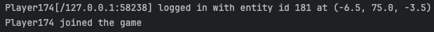
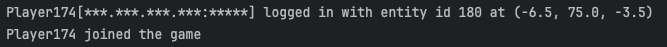

# Stop Doxxing My Ip Minecraft

Just a simple server side mod that adds a mixin to hide your IP when joining a server with this mod installed. 

## Why making this?
In this day and age where your IP is open in the wild (in logging or whatever) could be used maliciously by the wrong people. 

This is more a privacy feature in the server logging to prevent you from being doxxed and that's it. I feel personally this should've been done a long while ago as server admins don't need to know a players IP address when joining a server

This is a very niche of a mod. I know many won't care for this mod as it's only meant for server owners who kinda care about people's privacy.

## Why not use a VPN? Or other solutions?
Yes, a VPN should be sufficient tho it could make your connection worse when playing. 

Yes an IP could be dynamic so a user's IP is not always the same. However, it still could be used to doxx you by the wrong people.

## Will it have X feature?
It could, however that's not really the main purpose of this mod as it's meant to be used for server owners and not clients. I could consider making a privacy focused mod however I wouldn't really focus on that until this gains traction and such. 

## Compatibility

It should work with all of your most favorite server side mods. If not, report it here and I will work on a fix 

## Showcase
<ins>When sdmim is not installed on the server</ins>

<ins>When sdmim is installed on the server</ins>

## License
It's MIT, check the [LICENSE](./LICENSE) file
